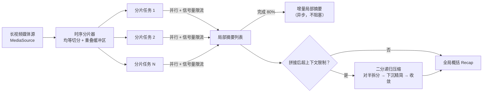

# vidrecap-agent

> Divide-and-conquer summarization for hours-long videos: parallel overlapped time sharding, incremental partial recaps, and binary recursive context compression.

**vidrecap-agent** 用"分治"思路解决一个真实痛点：3 小时的电视节目、会议录像、直播回放，内容量远超大模型的上下文窗口，没法一次性摘要。本项目把长视频时间轴切成带重叠缓冲区的分片，并行派发给多个子 Agent 生成局部摘要，再逐层收敛成全局概括。

核心引擎只依赖两个极简接口（`MediaSource` 媒体内容源 / `LLMClient` 大模型客户端），不绑定任何厂商——接谁家的语音识别、OCR、多模态模型都能跑。

## 特性

- **带重叠缓冲区的时序分片** —— 每个分片向前后各扩 N 秒缓冲区，一句话、一个剧情节点落在切点上也不会被拦腰斩断
- **并行派发 + 并发控制** —— asyncio + 信号量，N 路并发跑满而不打爆上游服务
- **80% 进度触发增量摘要** —— 大部分分片完成时异步先产出一版"局部回顾"，兼顾时效性
- **二分递归压缩兜底** —— 局部摘要拼接后超上下文限制时，自动对半拆分、递归精简，保证收敛
- **零厂商绑定** —— 核心引擎只认接口；`adapters/demo` 提供离线假实现，装完就能跑

## 快速开始

```bash
pip install -e .

# 离线 demo：内置假数据 + 抽取式假大模型，不需要任何 API Key
python -m vidrecap demo --hours 3 --context-limit 1200
```

输出示例：

```text
模拟视频 3.0 小时 | 分片 600s | 重叠缓冲 30s | 并行 4 | 上下文上限 1200 字符
[>>>>>>>>>>>>>>>>>>>>>>>>>>>>] 18/18 片段

=== 增量局部摘要（分片完成 80% 时异步生成） ===
[片段1] ...（省略）

=== 最终概括 ===
[片段1] ...

=== 统计 ===
分片数: 18 | 压缩轮次: 3 | 输入 55710 字符 -> 输出 1198 字符 (压缩到 2.1%)
```

## 架构



## 工作原理

**1. 柔性分片（`core/sharder.py`）**
责任区均等、取材带缓冲：第 i 个分片负责 `[i*L, (i+1)*L)`，实际取材 `[i*L-Δ, (i+1)*L+Δ]`。相邻分片在缓冲区里有少量重复内容，换来的是切点附近语义完整——这是用一点冗余成本换摘要连贯性的经典取舍。

**2. 增量摘要（`core/orchestrator.py`）**
分片完成数达到总数 80% 时，用已完成的局部摘要异步生成一版增量回顾，不等剩余分片。下游（比如值班编辑）可以先拿到"前 2.4 小时讲了什么"，全片概括随后再覆盖。

**3. 二分递归压缩（`core/compressor.py`）**
拼接摘要超过上下文上限时：已装得下 → 原样通过，零成本；装不下 → 按段落对半拆开，两边各自递归收敛，再合并；合并后仍超限 → 交给模型继续压缩，直到塞进去为止（有安全轮次上限）。

## 项目结构

```text
vidrecap/
├── core/            # 引擎核心（开源）
│   ├── models.py        # Shard / PartialSummary / RecapResult 数据模型
│   ├── protocols.py     # MediaSource / LLMClient 能力抽象
│   ├── sharder.py       # 时序分片 + 重叠缓冲区
│   ├── compressor.py    # 二分递归压缩
│   └── orchestrator.py  # 并行调度、增量摘要、最终融合
├── adapters/
│   └── demo/        # 离线假实现（开源）：假媒体源 + 抽取式假大模型
└── cli.py           # 命令行入口
tests/               # 单元测试 + 调度器集成测试
```

`core/` 与厂商解耦，`adapters/` 承载具体对接——真实的大模型客户端、ASR/OCR 适配器、面向客户系统的服务化封装按需扩展，不影响引擎本身。

## 路线图

- [ ] OpenAI 兼容接口适配器（接真实大模型）
- [ ] ASR / 字幕文件媒体源适配器（SRT、ASR 输出）
- [ ] 分片级失败重试与降级策略
- [ ] 摘要质量评测集与基准脚本
- [ ] 服务化封装（gRPC）

## 许可证

[MIT](LICENSE)
