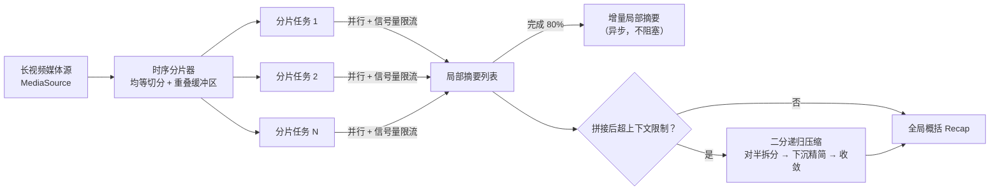

# vidrecap-agent

> Divide-and-conquer summarization for hours-long videos: parallel overlapped time sharding, incremental partial recaps, and binary recursive context compression.

**vidrecap-agent** 用"分治"思路解决一个真实痛点：3 小时的电视节目、会议录像、直播回放，内容量远超大模型的上下文窗口，没法一次性摘要。本项目把长视频时间轴切成带重叠缓冲区的分片，并行派发给多个子 Agent 生成局部摘要，再逐层收敛成全局概括。

核心引擎只依赖两个极简接口（`MediaSource` 媒体内容源 / `LLMClient` 大模型客户端），不绑定任何厂商——接谁家的语音识别、OCR、多模态模型都能跑。

## 特性

- **带重叠缓冲区的时序分片** —— 每个分片向前后各扩 N 秒缓冲区，一句话、一个剧情节点落在切点上也不会被拦腰斩断
- **并行派发 + 并发控制** —— asyncio + 信号量，N 路并发跑满而不打爆上游服务
- **80% 进度触发增量摘要** —— 大部分分片完成时异步先产出一版"局部回顾"，兼顾时效性
- **二分递归压缩兜底** —— 局部摘要拼接后超上下文限制时，自动对半拆分、递归精简，保证收敛
- **零厂商绑定** —— 核心引擎只认接口（`external/api/protocols.py`）；`external/adapters/demo` 提供离线假实现，装完就能跑
- **七层分离** —— 用户 / 服务 / 规划 / 规则 / 数据 / 外部 / 监控各管一摊，规划只出主意、服务只照做，分层规矩由 CI 强制（见 [AGENTS.md](AGENTS.md)）

## 快速开始

```bash
pip install -e .

# 离线 demo：内置假数据 + 抽取式假大模型 + 质检修正，不需要任何 API Key
python -m vidrecap demo --hours 3 --context-limit 1200

# 注入 10% 病句（丢主语 / 动词重复 / 截断），观察质检回路"挑出来、修好"
python -m vidrecap demo --hours 3 --poison

# 换上真实字幕（SRT 文件）：字幕是真的，模型仍是离线假模型，零 Key 可跑
python -m vidrecap demo --srt 节目.srt

# 接真实大模型（任意 OpenAI 兼容端点）：先设环境变量 OPENAI_API_KEY，模型名用 --model 或 OPENAI_MODEL
python -m vidrecap demo --srt 节目.srt --llm openai --model deepseek-chat

# 自定义分片摘要提示词（对 --llm demo 同样生效）
python -m vidrecap demo --srt 节目.srt --instruction "提炼每段的论点与结论"

# 跑评测集（打分器 49 题 + 修正器 15 题），低于基线时退出码非零
python -m vidrecap eval --suite all
```

输出示例：

```text
模拟视频 3.0 小时 | 分片 600s | 重叠缓冲 30s | 并行 4 | 上下文上限 1200 字符
[>>>>>>>>>>>>>>>>>>>>>>>>>>>>] 18/18 片段

=== 增量局部摘要（分片完成 80% 时异步生成） ===
[片段1] ...（省略）

=== 最终概括 ===
[片段1] ...

=== 统计 ===
分片数: 18 | 压缩轮次: 3 | 输入 55710 字符 -> 输出 1198 字符 (压缩到 2.1%)
```

## 架构



## 工作原理

**1. 柔性分片（规划层 `planning/windows.py` 定窗，服务层 `service/sharder.py` 取材）**
责任区均等、取材带缓冲：第 i 个分片负责 `[i*L, (i+1)*L)`，实际取材 `[i*L-Δ, (i+1)*L+Δ]`。相邻分片在缓冲区里有少量重复内容，换来的是切点附近语义完整——这是用一点冗余成本换摘要连贯性的经典取舍。

**2. 增量摘要（`service/orchestrator.py`）**
分片完成数达到总数 80% 时，用已完成的局部摘要异步生成一版增量回顾，不等剩余分片。下游（比如值班编辑）可以先拿到"前 2.4 小时讲了什么"，全片概括随后再覆盖。

**3. 二分递归压缩（规划层 `planning/splits.py` 决策，服务层 `service/compressor.py` 执行）**
拼接摘要超过上下文上限时：已装得下 → 原样通过，零成本；装不下 → 按段落对半拆开，两边各自递归收敛，再合并；合并后仍超限 → 交给模型继续压缩，直到塞进去为止（有安全轮次上限）。

## 项目结构

```text
vidrecap/
├── user/            # 用户层：命令行、将来的服务化入口（装配根）
├── service/         # 服务层：调度执行、按窗取材、递归压缩
├── planning/        # 规划层：定窗与拆分决策（纯函数，只出主意不执行）
├── rules/           # 规则层：打分规则、阈值闸门、护栏 + 项目宪法
├── data/            # 数据层：模型、计划对象、可调参数 PipelineConfig
├── external/        # 外部层：插座协议 + 适配器（demo 离线实现在此）
└── monitor/         # 监控层：统计与评测跑分
AGENTS.md            # 项目规则（给 agent 的入口，受 CI 检查）
docs/ARCHITECTURE.md # 架构讲解
tests/               # 单元测试、集成测试、分层硬检查
```

跨层调用只走每层的 `api/` 窗口：`from vidrecap.planning.api import plan_windows`。
引擎与厂商解耦，`external/adapters/` 承载具体对接——真实的大模型客户端、ASR/OCR 适配器、
面向客户系统的服务化封装按需扩展，不影响引擎本身。分层规矩与依赖方向见 [AGENTS.md](AGENTS.md)。

## 评测成绩

打分器与修正器都有离线可复现的成绩单（不需要 API Key）：

```bash
python -m vidrecap eval --suite all
```

```text
=== 评测成绩单 ===
考卷: all | 判定阈值: 0.70
用例数: 49
阈值准确率: 100.0%   基线 ≥ 95%   ✓
排序正确率: 100.0%   基线 ≥ 95%   ✓
修正成功率: 100.0%   基线 ≥ 80%   ✓
无幻觉率: 100.0%   基线 ≥ 100%   ✓
不倒退率: 100.0%   基线 ≥ 100%   ✓
好句不动率: 100.0%   基线 ≥ 100%   ✓
分类别准确率: clarity 100% | completeness 100% | fluency 100% | good 100% | mixed 100%
错题: 无
结论: 达到基线 ✓
```

考卷在 `vidrecap/monitor/evals/cases/`：打分器 49 条（三类病句各 8 坏 + 4 好对照、
5 条多重问题、8 条好句），修正器 15 条（12 条该修 + 3 条不该动的对照）。
低于基线时命令以非零码退出，可直接当门禁。

> **成绩要打个折扣看**：考卷和打分规则出自同一作者，满分只说明"规则与考卷自洽"，
> 不代表真实场景的准确率。真正价值有二：改动让质量退步时 CI 立刻拦下；
> 将来接真实大模型打分器/修正器时，可在同一批题上横向比分数。

## 路线图

近期（打分 → 评测 → 修正 → 注毒端到端）的详细计划、产出文件与验收标准见 [docs/ROADMAP.md](docs/ROADMAP.md)；
开源选型与许可证红线见 [docs/REUSE.md](docs/REUSE.md)。

- [x] 摘要质量打分器（清晰度 / 通顺度 / 完整度，0.7 阈值 + 单项一票否决）
- [x] 摘要质量评测集与基准脚本（`vidrecap eval`）
- [x] 语义补充修正 + 忠实性护栏（防幻觉）
- [x] demo 注毒与端到端评测（`--poison` 等开关）
- [x] SRT 字幕文件媒体源（`vidrecap demo --srt 文件.srt`）
- [x] OpenAI 兼容接口适配器（`--llm openai`，任意兼容端点，零新依赖）
- [ ] ASR 音频直转媒体源（涉及模型权重许可证红线，见 docs/REUSE.md）
- [x] 分片失败重试与降级（默认跳过并记账，重试参数可配）
- [x] 断点续跑（`--store`，sqlite 内容寻址缓存，重跑不再为已完成的分片花钱）
- [ ] 服务化封装（gRPC）

## 许可证

[MIT](LICENSE)
