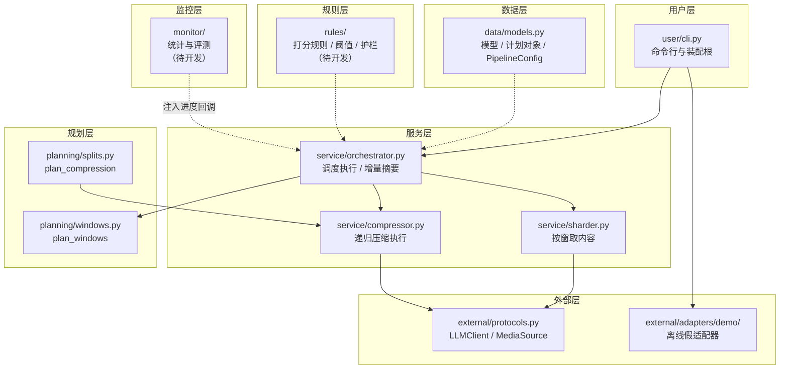

# vidrecap-agent 架构讲解

> 面向人的完整讲解。给 agent 的硬规则（含受 CI 检查的文件清单）在仓库根目录 [AGENTS.md](../AGENTS.md)。

## 一、这个项目解决什么问题

3 小时的节目录像，文字转写出来有几万字，远超模型一次能读的篇幅。做法是"分治"：

1. 把时间轴切成若干段，每段向前后各借一点内容当缓冲区（避免一句话被切点拦腰斩断）；
2. 每段并行送模型做局部摘要；
3. 局部摘要拼起来仍超长时，二分递归压缩到装得下为止；
4. 进度到 80% 时先异步产出一版"局部回顾"，不等全部跑完。

## 二、七层结构与数据流



实线是调用，虚线是"取数据/被注入"。注意两条方向约定：

- **没有箭头指向监控层**：统计与评测是消费者，服务层不认识它们。
- **规划层只被服务层调用**，且只回计划数据，不碰模型和网络。

## 三、逐层说明

### 用户层 `vidrecap/user/`

接单与交付：解析命令行参数、**装配**具体适配器、打印结果。
这是全项目**唯一的装配根**——"用哪个模型、哪个媒体源"只在这里决定一次，
将来加 gRPC 服务端也是同样的写法（同一个 `run_recap` 入口）。
实现在 `user/cli.py`，对外由 `user/api/` 窗口挂出。

### 服务层 `vidrecap/service/`

施工队。手里只有"怎么干"，没有"干不干、怎么切"。

- `orchestrator.py`：分片并发派发（信号量限流）、进度回调、80% 增量摘要、最终融合、统计汇总。
- `sharder.py`：按规划层给的窗口去媒体源取文本，组装 `Shard`。
- `compressor.py`：按规划层的单步计划递归收敛，超限时调模型继续压缩。

服务层对外主推任务级入口 `run_recap(source, llm, config, on_progress)`；
`Orchestrator` 类保留给需要自定义调度的高级用法。

### 规划层 `vidrecap/planning/`

军师：只产出计划，纯函数，不读时钟、不用随机、不做 I/O（CI 强制）。

- `windows.py::plan_windows(duration, shard_seconds, overlap_seconds)` → 时间窗列表。
- `splits.py::plan_compression(text, limit)` → `CompressionStep`（放行 / 对半拆）。

**为什么压缩的"决策"和"执行"要分开**：决策是可以离线穷举验证的纯逻辑
（装得下就不花钱、装不下怎么拆），执行涉及递归、并发和模型调用。
分开以后，决策部分能 100% 被单元测试覆盖，执行部分只需要验证"照做"。

### 规则层 `vidrecap/rules/`

两件事：判断标准（质量三指标打分、0.7 阈值闸门、防幻觉护栏，待开发），
以及项目宪法（本文件与 `AGENTS.md` 的维护责任）。同样要求纯判断。

### 数据层 `vidrecap/data/`

数据长什么样：`Shard` / `PartialSummary` / `RecapStats` / `RecapResult`、
计划对象 `CompressionStep`、可调参数 `PipelineConfig`。
**可调参数的默认值只在这里出现一次**，服务层消费它、用户层覆盖它。

### 外部层 `vidrecap/external/`

插座与适配器。插座是两个 Protocol（定义在 `external/protocols.py`，由 `external/api/` 窗口挂出——
窗口本身只准放转出语句，不放类定义）：

```python
class LLMClient(Protocol):
    async def summarize(self, text: str, instruction: str = "") -> str: ...

class MediaSource(Protocol):
    def duration(self) -> float: ...
    def content(self, start: float, end: float) -> str: ...
```

`adapters/demo/` 是随仓库发布的离线假实现（假模型 + 假节目源），
特点是有意做成**确定性**的：同一时间段永远返回同一段文本，
所以重叠缓冲区里相邻分片拿到的确实是同一段话，评测集也能完全复现。

### 监控层 `vidrecap/monitor/`

评测与统计（待开发）：跑分器（阈值准确率、排序正确率、修正成功率、无幻觉率）、
CI 基线门槛。它是消费者——读服务层的结果、用规则层的标准，服务层不依赖它。

## 四、一次完整任务的时间线

1. 用户层组装 `PipelineConfig` 与适配器，调用 `run_recap`。
2. 服务层向规划层要窗口（`plan_windows`），再按窗口向媒体源取内容组装分片。
3. 分片并行送模型摘要，每完成一个回调一次进度。
4. 完成数达到 80% 时，后台异步拼一版增量回顾（不阻塞主流程）。
5. 全部完成后按时间序拼接局部摘要；超上下文限制时向规划层逐步要"拆分计划"，
   递归压缩直到装得下。
6. 汇总统计（分片数、压缩轮次、字符进出）返回给用户层展示。

## 五、怎么扩展

**加一个新适配器（比如接真实模型）**

1. 在 `external/adapters/<厂商>/` 新建实现，对照 `external/protocols.py` 的插座写方法；
2. 在 `external/api/__init__.py` 挂出想公开的类；
3. 在 `user/cli.py` 里加一个开关来选用它（装配根只在这里）；
4. 补测试，更新 `AGENTS.md` 第 8 节清单。

**加一条新规则（比如打分器）**

1. 规则落在 `rules/`，纯判断、可离线测；
2. 打分结果的模型放 `data/models.py`；
3. 在 `rules/api/__init__.py` 挂出；
4. 需要服务层调用时，由服务层从窗口取——不要反过来。

**加一类新处理逻辑**

先到 `AGENTS.md` 第 5 节的"计划 / 执行配对表"找位置：计划函数进规划层，
执行函数进服务层。找不到配对说明这是新的一类，先补表再写代码。
